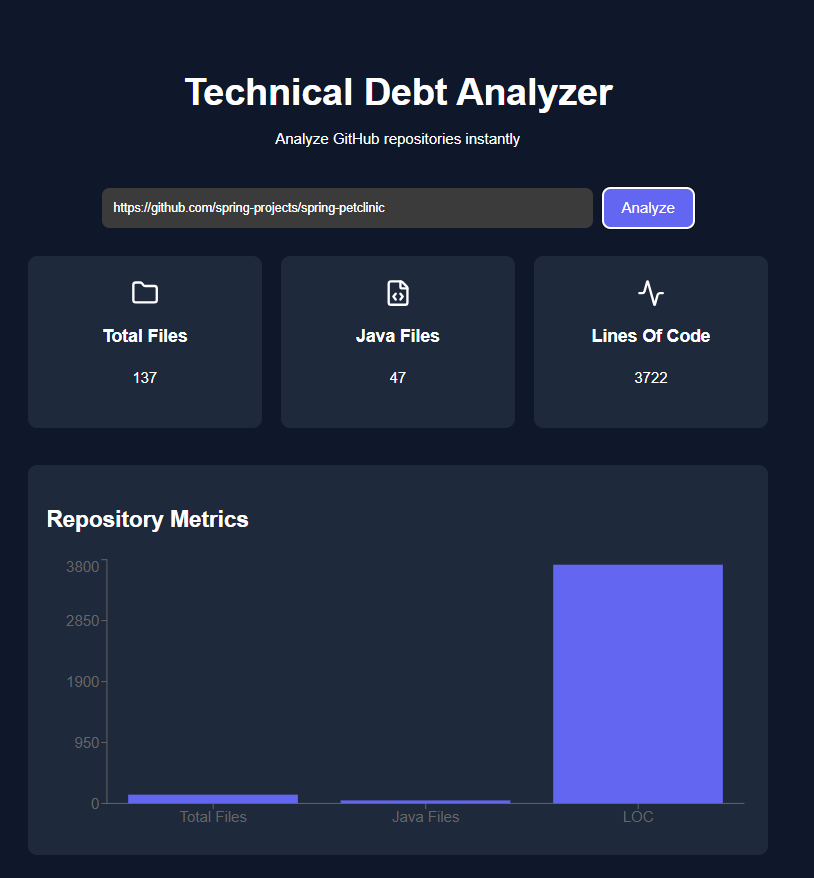

# Technical Debt Analyzer

A **full-stack developer tool** that analyzes GitHub repositories and provides insights about **codebase size, structure, and potential technical debt**.

The system scans repository files, processes source code metrics, and provides quick insights into project complexity.

---

# 🚀 Project Preview



---

# 🔎 Key Highlights

• Built automated analyzer scanning **150K+ lines of code across 5,000+ files**  
• Developed **10+ REST APIs** for repository management and technical debt detection  
• Designed scalable database with **4 entities (Project, Analysis, FileMetrics, CodeIssue)**  
• Implemented backend using **Spring Boot + JPA (Hibernate)**  
• Built modern frontend using **React + Vite**

---

# 🛠 Tech Stack

## Backend
- Java
- Spring Boot
- Spring Data JPA
- REST APIs
- GitHub API Integration

## Frontend
- React
- Vite
- JavaScript
- HTML
- CSS

## Database
- MySQL
- JPA / Hibernate ORM

---

# ⚙️ Features

✔ Analyze any public GitHub repository  
✔ Automatically detect number of **Java source files**  
✔ Calculate **total lines of code**  
✔ Scan repository structure  
✔ Store analysis results in database  
✔ Backend **REST API architecture**

---

# 📊 Example Analysis Output

Total Files: **137**

Java Files: **47**

Lines of Code: **3722**

---

# 📂 Project Structure

```
technical-debt-analyzer
│
├── backend
│   ├── controller
│   ├── service
│   ├── repository
│   ├── entity
│   └── security
│
├── frontend
│   ├── React + Vite UI
│
└── database
    └── JPA Entities
```

---

# 🔧 Installation

## Clone the repository

```
git clone https://github.com/yashphy04/job-portal-springboot.git
```

---

## Run Backend

```
cd backend
mvn spring-boot:run
```

---

## Run Frontend

```
cd frontend
npm install
npm run dev
```

---

# 🌐 Access Application

Backend

```
http://localhost:8080
```

Frontend

```
http://localhost:5173
```

---

# 🎯 Future Improvements

• Technical debt scoring algorithm  
• Code complexity analysis  
• Multi-language repository support  
• Visualization dashboards  
• GitHub repository insights dashboard  

---

# 👨‍💻 Author

**Yash Raj**

Java Backend Developer  

LinkedIn  
https://www.linkedin.com/in/yash-raj-java/
